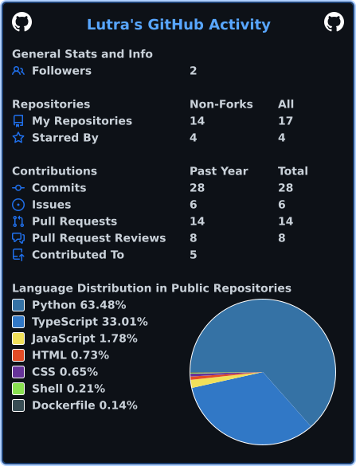

  

  

 

## 👋 About Me

🎓 PhD Candidate in Computer Science at **Dalian University of Technology**
🔬 Research Direction: **AI Agents, Reliable Agentic Systems, and AI for Intelligent Manufacturing**

## 📚 Research Interests

<table>
  <tr>
    <td width="50%" valign="top">
      <h3>⏳ Long-Horizon Agent Reliability</h3>
      <ul>
        <li>Failure lock-in &amp; recoverability</li>
        <li>Error propagation in long-horizon trajectories</li>
        <li>Verification and generation–verification gaps</li>
        <li>Reliable coding / CLI agents</li>
        <li>Agent evaluation and failure analysis</li>
      </ul>
    </td>
    <td width="50%" valign="top">
      <h3>🏭 AI Agents for Intelligent Manufacturing</h3>
      <ul>
        <li>Intelligent process planning</li>
        <li>CNC machining &amp; manufacturing agents</li>
        <li>CAD/CAM automation</li>
        <li>LLM-based manufacturing knowledge reasoning</li>
        <li>Tool-using agents for engineering software</li>
        <li>Human knowledge distillation for manufacturing agents</li>
      </ul>
    </td>
  </tr>
</table>

## 🔭 What I'm Currently Working On

**Manufacturing Agent** — Building an AI agent for precision machining process planning:

`Engineering Knowledge → Process Planning → CAD/CAM → CNC`

- Manufacturing knowledge retrieval and reasoning
- Machining process planning &amp; Mastercam automation (.NET API / scripting)
- MCP-based engineering tool interfaces
- Learning manufacturing knowledge from technical documents and instructional videos

**Reliable Long-Horizon Agents** — Studying why AI agents fail during long-running tasks and whether they can recover from intermediate mistakes:

- When does an agent enter an unrecoverable state, and how can recoverability be measured?
- How do early mistakes propagate through long trajectories?
- When does verification fail to provide useful guidance?
- How should agent systems detect and recover from failure lock-in?

## 🛠 Tech Stack

  

- **Architectures**: SGLang, AriGraph, Medical LLMs, Context Management
- **Domains**: Hemodialysis Data Analytics, Multi-modal Fusion, Chronic Disease Tracking
- **Philosophy**: Reliability over Hype · Smooth, Zen-like Engineering · Human-Centric AI

## 📊 GitHub Stats

  

  

## 🐍 Contribution Snake

  <picture>
    <source media="(prefers-color-scheme: dark)" srcset="https://raw.githubusercontent.com/cosmic-snail/cosmic-snail/output/github-snake-dark.svg"/>
    <source media="(prefers-color-scheme: light)" srcset="https://raw.githubusercontent.com/cosmic-snail/cosmic-snail/output/github-snake.svg"/>
    
  </picture>

## 🔧 Projects

- **[UB Service Core Engine](https://gitcode.com/openeuler/ubs-engine)** — Distributed Resource Optimization Management Framework (2024–2026)
  - 🔨 Recent PR: [feat: implement urma_controller_api](https://gitcode.com/openeuler/ubs-engine/pull/39)

## 📫 Contact

  
  

 

  

